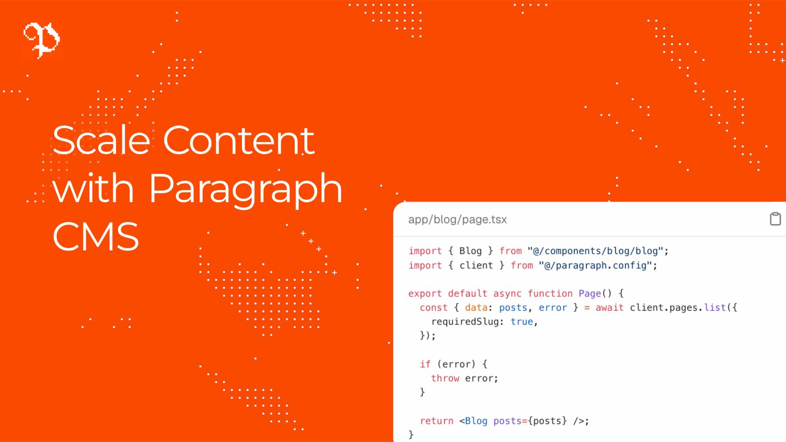

# @paragraphcms/client

Official TypeScript client for the Paragraph CMS API.

<p align="center">
  
</p>

`@paragraphcms/client` is a small, typed SDK for the Paragraph CMS API. It runs in Node.js 18+ and other server-side runtimes that expose `fetch`.

Internally, the client uses `ky` for HTTP transport and retries, plus `Bottleneck` for per-instance rate limiting.

## Install

```bash
npm install @paragraphcms/client
# or
pnpm add @paragraphcms/client
# or
yarn add @paragraphcms/client
```

## Quick Start

Create a client instance with your API key:

```ts
import { Client } from "@paragraphcms/client";

const client = new Client({
  apiKey: process.env.PARAGRAPH_API_KEY!,
});
```

Every client method returns a non-throwing result object:

```ts
const { data, error } = await client.page.getBySlug("pricing");

if (error) {
  console.error(error.message);
  return;
}

console.log(data.title);
```

On success, `error` is `null`. On failure, `data` is `null` and `error` is a `ParagraphApiError` or `ParagraphClientError`.

### Get Published Pages or Pages From a Collection

```ts
const { data: publishedPages, error: publishedPagesError } =
  await client.pages.list();

const { data: allPages, error: allPagesError } = await client.pages.list({
  published: false,
});

const { data: collectionPages, error: collectionPagesError } =
  await client.pages.list({
  collection: "Blog",
});

const { data: collectionPagesById, error: collectionPagesByIdError } =
  await client.pages.list({
  collectionId: "collection-id",
});

const { data: pagesWithSlugs, error: pagesWithSlugsError } =
  await client.pages.list({
  requiredSlug: true,
});

if (
  publishedPagesError ||
  allPagesError ||
  collectionPagesError ||
  collectionPagesByIdError ||
  pagesWithSlugsError
) {
  console.error("Request failed.");
  return;
}

console.log(publishedPages.length);
console.log(publishedPages.map((page) => page.title));
console.log(allPages.map((page) => page.title));
console.log(collectionPages.map((page) => page.title));
console.log(collectionPagesById.map((page) => page.title));
console.log(pagesWithSlugs.map((page) => page.slug.toUpperCase()));
```

`client.pages.list()` now returns only published pages by default. To include unpublished pages, pass `published: false`.
When neither `page` nor `limit` is passed, `client.pages.list()` fetches every matching API page and returns the pages array directly. Pass `page` or `limit` to receive a paginated response with `data` and `meta`.
Passing `requiredSlug: true` also narrows `page.slug` to `string` in TypeScript.

### Get a Page by Slug

```ts
const { data: page, error } = await client.page.getBySlug("pricing");

if (error) {
  console.error(error.message);
  return;
}

console.log(page.id);
console.log(page.title);
console.log(page.slug.toUpperCase());
```

### Get All Supported Languages

```ts
const { data: locales, error } = await client.locales.list();

if (error) {
  console.error(error.message);
  return;
}

console.log(locales.map((locale) => locale.code));
```

### Upload and Update Media

```ts
const { data: uploadedMedia, error: uploadError } = await client.media.upload({
  file: imageBuffer,
  fileName: "hero.png",
  contentType: "image/png",
  pageId: "page-id",
  slug: "hero-image",
  alt: "Hero image caption",
});

if (uploadError) {
  console.error(uploadError.message);
  return;
}

const { data: updatedMedia, error: updateError } = await client.media.update(
  uploadedMedia.media.id,
  {
    slug: "hero-image-updated",
    alt: "Updated hero image caption",
  },
);

if (updateError) {
  console.error(updateError.message);
  return;
}

console.log(updatedMedia.media.slug);
console.log(updatedMedia.media.alt);
```

## Framework Guides

Build with:

- [Next.js](https://paragraphcms.com)
- [Nuxt](https://paragraphcms.com)
- [Astro](https://paragraphcms.com)
- [SvelteKit](https://paragraphcms.com)
- [Remix](https://paragraphcms.com)

## Documentation

For full guides and API reference, see [paragraphcms.com](https://paragraphcms.com).

## License

MIT
